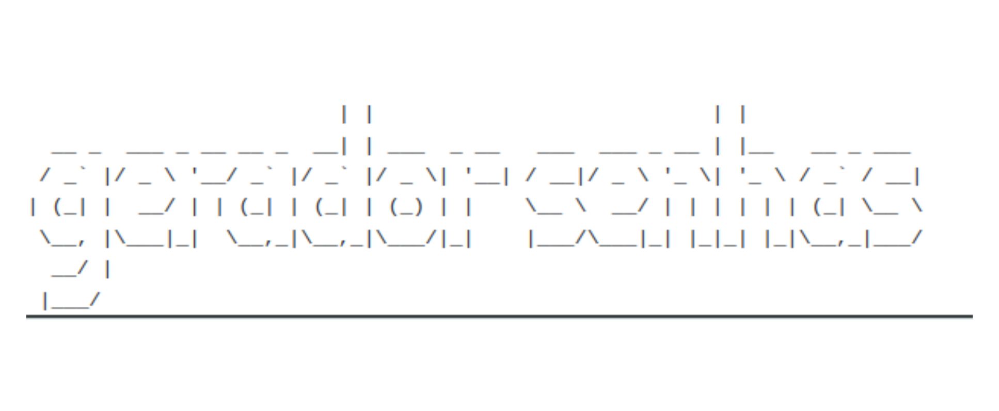

Gerador de senhas em shell-script <b>bash</b>.

 

 

1. Permissão de execução
`chmod +x ./gerarsenha.sh` 
`ls -lh gerarsenha.sh` 

2. Gerar senhas alfanumerico
`sh gerarsenha.sh` 
`./gerarsenha.sh` 

3. Informar o tamanho da senha
> Ex: 100